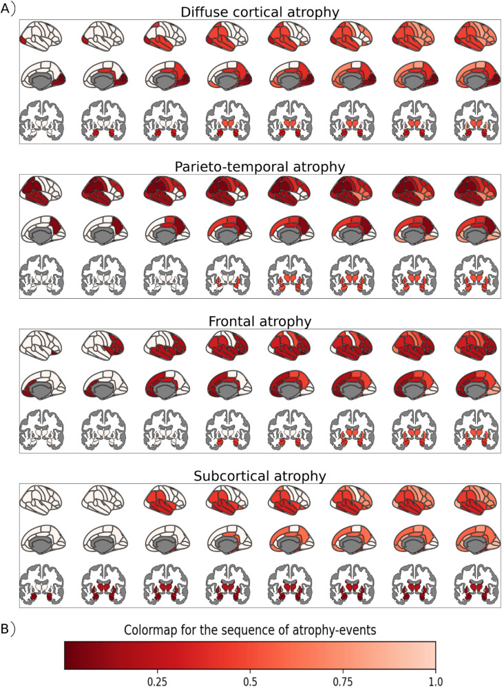

# Snowphlake - A tool for identifying disease subtypes and modeling disease progression
Snowphlake stands for: Staging NeurOdegeneration With PHenotype informed progression timeLine of biomarKErs

If you are using this work, please cite our paper: [A large-scale multi-centre study characterising atrophy heterogeneity in Alzheimer's disease](https://doi.org/10.1016/j.neuroimage.2025.121381)



## Installation Instructions

Click [here](./installation_instructions.md) for installation instructions

### A typical call on a toy dataset is shown here:
```
import numpy as np
import snowphlake as spl
from snowphlake.load_dataset import load_dataset
from sklearn.impute import SimpleImputer

data=load_dataset() #Toy dataset
diagnosis=data['Diagnosis'].values
data=data.drop(['Diagnosis','PTID','Age','Sex','ICV','EXAMDATE','ABeta'],axis=1,errors='ignore')
#Remove the effects of the confounders before calling snowphlake. This is not done in the toy dataset

#Impute missing values if necessary.
imp = SimpleImputer(missing_values=np.nan, strategy='mean')
imp.fit(data.values)
data_imputed=imp.transform(data.values)
biomarkers_selected = list(data)

T = spl.timeline(estimate_uncertainty=False, estimate_subtypes = True,\
    diagnostic_labels=['CN','SCD','MCI','AD'], n_maxsubtypes=6, model_selection='full',\
    random_seed=100, n_nmfruns=500, n_cpucores = 8)

S, Sboot = T.estimate(data_imputed,diagnosis,biomarkers_selected)
```
"n_nmfruns" should roughly be equal to $25 \times n_{AD}$, where $n_{AD}$ is the number of patients with highest clinical stage (e.g. with AD dementia). However, for ease of testing in the toy dataset, n_nmfruns is set equal to $n_{AD}$ in the above example.

The optimum number of subtypes is estimated automatically using one of the many criteria available in subtyping literature. 

Take a look at the residual matrices T.subtyping_model.rss_data and T.subtyping_model.rss_random for a quick check.
```
print(np.diff(T.subtyping_model.rss_data))
print(np.diff(T.subtyping_model.rss_random))
check_opt=np.abs(np.diff(T.subtyping_model.rss_data)) > np.abs(np.diff(T.subtyping_model.rss_random)) 
if any(check_opt):
    nopt = max(i for i, val in enumerate(check_opt) if val) + 2
else:
    nopt = 1

# However, the implemented model chooses subtypes conservatively by:
check_opt=np.abs(np.diff(T.subtyping_model.rss_data)) > np.max(np.abs(np.diff(T.subtyping_model.rss_random)))
```

Once you examine if the criteria used suits your application, you can compute the final measure as follows:
```
nopt=T.n_optsubtypes # or change based on adjusted criterion
Topt = spl.timeline(estimate_uncertainty=True, estimate_subtypes = True,\
        diagnostic_labels=['CN','SCD','MCI','AD'], n_optsubtypes=nopt,\
        random_seed=100, n_nmfruns=500, n_cpucores = 8)
Sopt, Sbootopt = Topt.estimate(data_imputed,diagnosis,biomarkers_selected)

```

If "estimate_subtypes" is False, the code estimates a progression timeline (without subtyping) using [DEBM](https://doi.org/10.1016/j.neuroimage.2018.11.024)

If "n_cpucores" $>1$, subtyping is done using parallel processing.

The input format for data, diagnosis, and biomarkers_selected are explained below:

**data**: A $N \times M$ numpy matrix with no missing values. $N$ = the number of patients in the training dataset. $M$ = number of biomarkers for each patient. Each row must correspond to one timepoint for a patient. Please note that the method does not account for multiple timepoints per patient.

**diagnosis**: $N \times 1$ numpy matrix with no missing values. Each element in this array should be a string that correspond to one of the elements in the "diagnostic\_labels" variable defined above. "diagnostic\_labels" should in turn be mentioned in the order of increasing severity of clinical staging.

**biomarkers\_selected**: A list of length $M$. Each element in the list should correspond to the name of the biomarker used, with no special characters.

T.sequence_model['ordering'] contains all the predicted orderings of biomarkers
T.n_optsubtypes contains the optimum number of subtypes selected
S contains all patient-specific information

Once trained, spl.predict function can be used for the test-set.
